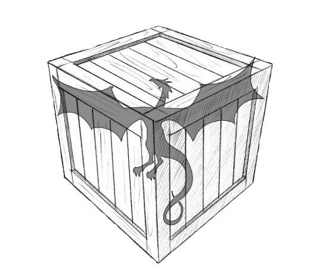

# **Black Arrow Arsenal**

  
  <!-- https://raw.githubusercontent.com/BlackArrowGang/Arsenal/main/quiver/gh-actions-arm64-build/media/banner.jpg -->

 **🛠️Welcome To Arsenal🏹**

Arsenal is your ultimate toolkit for optimizing the development journey. Our curated collection offers a wide array of solutions, including Terraform codes, robust pipelines, and advanced AWS infrastructure implementations. With Arsenal, you can effortlessly streamline workflows, boost productivity, and unlock unparalleled efficiency in your projects.

## **Table of Contents**

- [Solutions](#solutions)
  - [Amazon Web Services](#amazon-web-services)
  - [Github Actions](#github-actions)
- [Usage](#usage)
- [Contributing](#contributing)
- [Support](#support)

## **Solutions**
The quiver folder in this repository serves as a collection of various platform projects and tools. Here are some of the remarkable projects you can find within Arsenal:

### Amazon Web Services
- [aws-bastion-ssm](https://github.com/BlackArrowGang/Arsenal/tree/main/quiver/aws-bastion-ssm) <a href="https://www.blackarrowgang.com/blog/aws-bastion-ssm/" target="_blank">...</a>
- [aws-lambda-container](https://github.com/BlackArrowGang/Arsenal/tree/main/quiver/aws-lambda-container) <a href="https://www.blackarrowgang.com/blog/aws-lambda-container/" target="_blank">...</a>
- [aws-rds-proxy](https://github.com/BlackArrowGang/Arsenal/tree/main/quiver/aws-rds-proxy) <a href="https://www.blackarrowgang.com/blog/aws-rds-proxy/" target="_blank">...</a>
- [aws-serverless-rds-cluster](https://github.com/BlackArrowGang/Arsenal/tree/main/quiver/aws-serverless-rds-cluster) <a href="https://www.blackarrowgang.com/blog/aws-serverless-rds-cluster/" target="_blank">...</a>
- [aws-vpn-client](https://github.com/BlackArrowGang/Arsenal/tree/main/quiver/aws-vpn-client) <a href="https://www.blackarrowgang.com/blog/aws-vpn-client/" target="_blank">...</a>

### Github Actions
- [gh-actions-arm64-build](https://github.com/BlackArrowGang/Arsenal/tree/main/quiver/aws-vpn-client) <a href="https://www.blackarrowgang.com/blog/gh-actions-arm64-build/" target="_blank">...</a>

## **Usage**
Each solution within Arsenal has its own dedicated directory containing relevant documentation and code. Before using a specific tool, refer to the corresponding directory for detailed information on the solution that it offers.

### **Common Requirements**
| Name     | Version  |
|----------|----------|
|[Terraform](https://developer.hashicorp.com/terraform/tutorials/aws-get-started/install-cli) | >= 1.0 |
|[AWS CLI](https://github.com/aws/aws-cli)  | >= 2.0 |
|[Docker](https://www.docker.com/products/docker-desktop/)   | >= 24.0 |
|[OpenVPN](https://openvpn.net/community-downloads/)   | >= 2.5 |

## **Contributing**
Contributions to Arsenal are more than welcome! They can range from bug fixes and feature enhancements to entirely new projects or tools.

## **Support**
If you encounter any issues or need assistance setting things up, Hire us and we can do it for you. 

To get started, you can visit our website [blackarrowgang.com](https://blackarrowgang.com) to explore our services and schedule a meeting with our team. We are committed to providing you with the necessary support and guidance.

Dont forget to checkout our youtube channel [Black Arrow Gang](https://www.youtube.com/@blackarrowgang3373), where we will showcase the functionality of this services in the future. 

And if you are feeling generous you can go ahead and buy us a cup a coffee.

