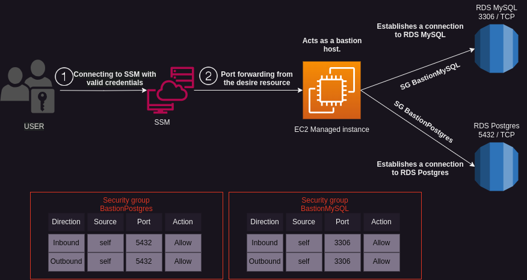

# **Streamlined Secure Access: Effortless AWS Bastion Setup **
<!-- It will be required another title for this service -->

## **Description**
This Terraform provisions the infrastructure for a fully managed bastion. The bastion serves as secure entry point to access your resources within a Virtual Private Cloud (VPC). By levearing SSM, you can establish a secure and controlled connection to your resources withouth the need for public IP or opening inbound SSH ports.

## **Use Cases**
The Terraform bastion setup can be utilized in various scenarios, including:

1. **Secure Remote Access**: Provide a secure remote access solution by allowing authorized users to connect to AWS resources through the bastion host. Users can securely manage and administer resources without directly exposing them to the public internet.

2. **Bastion Alternative**: Replace traditional bastion hosts with this setup. The bastion host acts as an intermediate access point, allowing direct connection to resources located in private subnets based on ports.

3. **Enhanced Security**: Restrict access to resources by leveraging security groups to control inbound and outbound traffic between the bastion host and other resources. This helps protect sensitive data and ensures that only authorized communication is allowed.

## **Diagram**


## **How It Works**

### **Requirements**
- [Terraform](https://developer.hashicorp.com/terraform/tutorials/aws-get-started/install-cli)
- [AWS CLI](https://github.com/aws/aws-cli)
- [Session Manager Plugin](https://docs.aws.amazon.com/systems-manager/latest/userguide/session-manager-working-with-install-plugin.html)
- Apply ssm:StartSession policy to user
- Set document/AWS-StartPortForwardingSessionToRemoteHost on user's policy


Steps: 
1. Run `terraform init` to install modules : This will install the necesarie modules to init

2. Run `terraform plan` to review changes in you actual aws infraestructuresu

3. Change local variables if needed
   
    defaul variables: 

    ```json
    locals {
        aws_region      = "us-east-2"  # Specify the AWS region where the infrastructure will be deployed
        vpc_cidr_block  = "142.32.0.0/16"  # Define the CIDR block for the VPC
        ami_id          = "ami-01107263728f3bef4"  # Specify the ID of the AMI
        instance_type   = "t2.micro"  # Specify the type of the EC2 instance
        vpc_name        = "BastionVPC" # Provide a name for the VPC
        ec2_tag_name    = "Bastion EC2" # Specify a name tag for the EC2 instance
    }
    ```
3. Run `terraform apply` to apply changes on infraestructure

## Usage
TODO
``` bash
aws ssm start-session \
    --target <instance_id> \
    --document-name AWS-StartPortForwardingSessionToRemoteHost \
    --parameters '{"host":["<host_url>"],"portNumber":["<host_port>"], "localPortNumber":["<local_port>"]}'
```
## Support
If you encounter any issues or have questions related to this AWS VPN setup with Terraform, or need assistance setting up the VPN or any other related services, Hire us and we can do it for you. 

To get started, you can visit our website [blackarrowgang.com](https://blackarrowgang.com) to explore our services and schedule a meeting with our team. We are committed to providing you with the necessary support and guidance to ensure a successful implementation of your VPN infrastructure.

Dont forget to checkout our youtube channel [Black Arrow Gang](https://www.youtube.com/@blackarrowgang3373), where we will showcase the functionality of this services in the future. 

And if you are feeling generous you can go ahead and buy us a cup a coffee.

[](https://blackarrowgang.com)