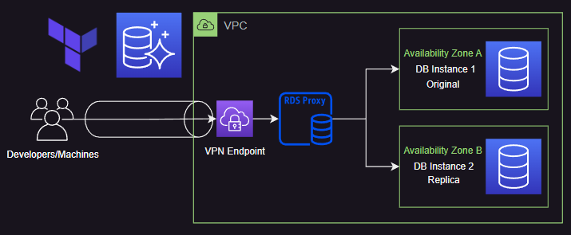

<!-- 
---
type: "post"
title: "Achieve High Availability with AWS RDS Proxy and Terraform"
topic: "Provisioning"
date: "2023-07-01T15:30:00-07:00"
author: "Fernando Reyes"
time: "2 min read"
description: "Boost your Amazon RDS databases with AWS RDS Proxy! Experience unrivaled scalability, availability, and security. With automatic connection pooling and failover mechanisms, managing your databases becomes a breeze. "
url: "/services/aws-rds-proxy"
---
-->

# **Achieve High Availability with AWS RDS Proxy and Terraform**

Boost your Amazon RDS databases with AWS RDS Proxy! Experience unrivaled scalability, availability, and security. With automatic connection pooling and failover mechanisms, managing your databases becomes a breeze. Eliminate manual scaling and unleash the true potential of your Amazon RDS infrastructure. Discover the game-changing power of AWS RDS Proxy today!



## **Use Cases**
1. **Flexible Traffic Redirection:** Provides exceptional flexibility for redirecting and distributing database traffic to accommodate evolving application requirements. It enables seamless redirection of incoming traffic across multiple database instances without the need to modify application code.

2. **Highly Scalable Database Connections:** Simplifies managing database connections. With connection pooling and automatic scaling, it handles thousands of concurrent connections, ensuring scalability for your applications.

3. **Improved Database Performance:** By leveraging AWS RDS Proxy, you can enhance the performance of your applications that interact with the database. RDS Proxy helps reduce connection establishment times and handles connection pooling efficiently, resulting in faster response times and improved overall database performance.

## **How It Works**

- **KMS Module**:
  - Creates a Key Management Service (KMS) key with the description "RDS key usage" and key usage set to "ENCRYPT_DECRYPT".
  - Sets an alias for the key as "metalab/rds".

- **Secrets Manager**:
  - Creates a Secrets Manager secret named "root-2" with a description of "RDS super user credentials".
  - Associates the created KMS key with the Secrets Manager secret.

- **RDS Proxy Module**:
  - Creates an RDS Proxy named "rds-proxy" to provide connectivity and pooling capabilities to Amazon RDS or Aurora database instances.
  - Sets the IAM role name to "rds-proxy-role" for managing access to the proxy.
  - Disables IAM authentication for the proxy (`iam_auth = "DISABLED"`).
  - Enables the creation of an IAM policy and IAM role for the proxy.
  - Manages the log group for the proxy is set to false (`manage_log_group = false`).
  - Disables the requirement of Transport Layer Security (TLS) for connections to the proxy (`require_tls = false`).
  - Configures the VPC subnet IDs and security group IDs for the read-write endpoint of the proxy, allowing connections from the specified subnets and security groups.
  - Specifies the secrets to be associated with the proxy, in this case, the "root" secret.
  - The "root" secret is described as "Aurora PostgreSQL superuser password" and is associated with the KMS key and ARN of the "root" secret created in the Secrets Manager section.

- **Aurora PostgreSQL**:
  - Creates an Amazon Aurora PostgreSQL database with the specified engine version, master username, and password.
  - Configures VPC settings, including VPC ID, subnet group name, and security group IDs.
  - Sets up security group rules for ingress traffic.
  - Configures serverless scaling settings.

- **Security Groups**:
  - Creates a security group named "vpn_access" allowing inbound traffic on port 443 from any IP address.
  - Creates a security group named "rds_access" allowing inbound and outbound traffic on port 5432 within the security group itself.
  - Creates a security group named "access_networks" allowing all inbound and outbound traffic within the security group itself.


## **Usage**

Requirements
* AWS CLI
* Terraform

**Note:** It might take a few minutes to fully create.

To use this code, follow these steps:

1. Open a terminal window.
2. Run the following commands

```
terraform init
```
```
terraform plan
```
```
terraform apply
```

## **Support**

If you encounter any issues or need assistance setting things up, Hire us and we can do it for you. 

Want to try things for yourself?, checkout our github repository [Arsenal](https://github.com/BlackArrowGang/Arsenal/tree/dev/quiver/aws-rds-proxy).

To get started, you can visit our website [blackarrowgang.com](https://blackarrowgang.com) to explore our services and schedule a meeting with our team. We are committed to providing you with the necessary support and guidance.

Dont forget to checkout our youtube channel [Black Arrow Gang](https://www.youtube.com/@blackarrowgang3373), where we will showcase the functionality of this services in the future. 

And if you are feeling generous you can go ahead and buy us a cup a coffee.

[](https://blackarrowgang.com)
